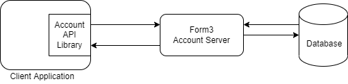

# Form3 Take Home Exercise

## Overview

This is a client library written in Go that interacts with a fake Form3 Account API. It supports the following operations :
* Create - creates a new organisation account
* Fetch - retrieves a single organisation account if it exists
* Delete - deletes an organisation account given its Id and Version

I am a beginner in GOLang and this is my first project using GO. Although, I have 6 years of experience in software development (primarily using JAVA), therefore, have focused on developing this client library in an extensible way using SOLID and design principles.

## Running the tests

For running the tests against the provided fake account API, the following command can be run :

```
docker-compose up
```

## Example of using the client library

```
f3 := form3.Init("http://localhost:8080")

// creates an organisation account 
account, err = f3.Create(account)

// retrieve a single organisation using the accountID
account, err = f3.Fetch(accountId)

// deletes an organisation account with the accountID and version
response,err = f3.Delete(accountId, 0)

```

## Technical Overview

An overview of library design :

### Project Structure

The project has a 'core' package which comprises of core functionalities like making a request and parsing response received. These can be reused for other entities, making this client library extensible. The functions package hosts implementation public APIs for performing account related operations. The data models are placed under models package.

### Client library Implementation
The client library is designed in a way that it can be enhanced for performing operations on other entities as well. The requests and response implementations are designed as 
a wrapper over vanilla http request/response implementations for providing more control such as  including different headers, request parameters if required.

### Testing
All the modules have been thoroughly tested. Along with this, I have added integration tests by connecting to the FakeAccount API provided and these tests can be run using docker-compose up as requested.

### Container Details
For testing, a fake Account API client using this client API is provided using Dockerfile.
The docker-compose.yml starts up the following three containers:
1. Form3 Account Server
2. Postgres database
3. Client Application

Following is representation of the application:



## Future Enhancements
1. Add support for List and Put operations
2. Enhance support for client side validations
3. Reuse the Core functionality and extend this library for other entities
